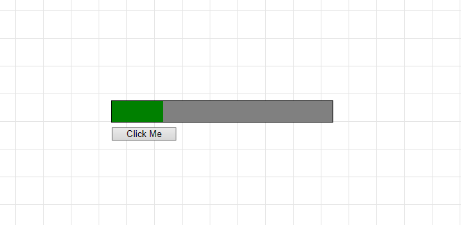
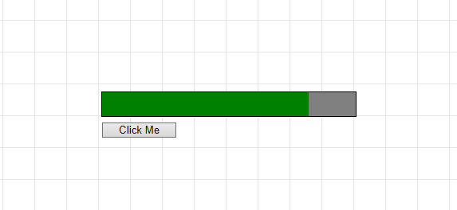

# QuickProgressBars

Just a simple test to see how quickly I could make a progress bar using either JavaScript or pure CSS after seeing a similar example the other day. I ended up producing both working CSS and JavaScript versions. The JavaScript version is mostly commented out. I added a scrolling background image to improve the visuals.

The code was inspired by [Code Drip](https://www.youtube.com/channel/UCRLEADhMcb8WUdnQ5_Alk7g) and is nearly identical to his besides the animated background and function/variable name changes along with formatting of the actual divs, etc.

## License

[MIT](https://choosealicense.com/licenses/mit/)
